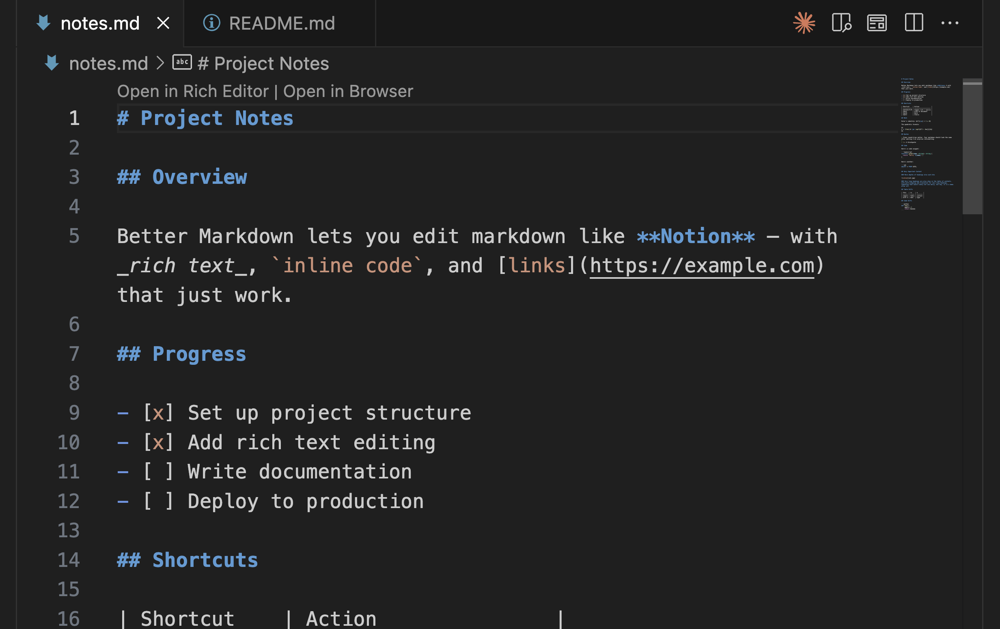
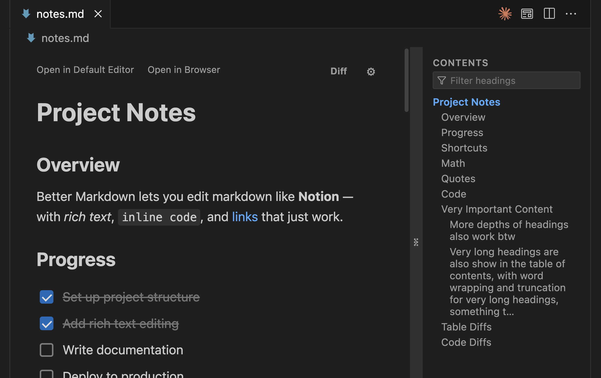
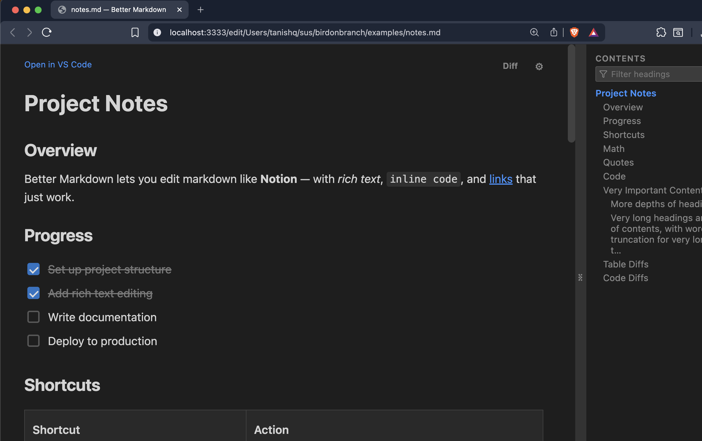
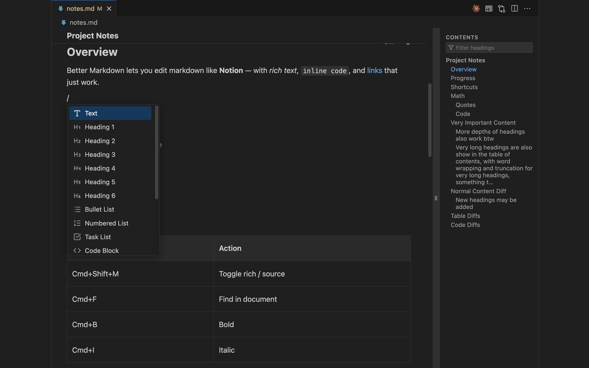
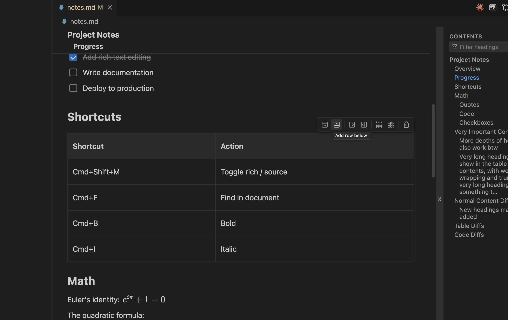
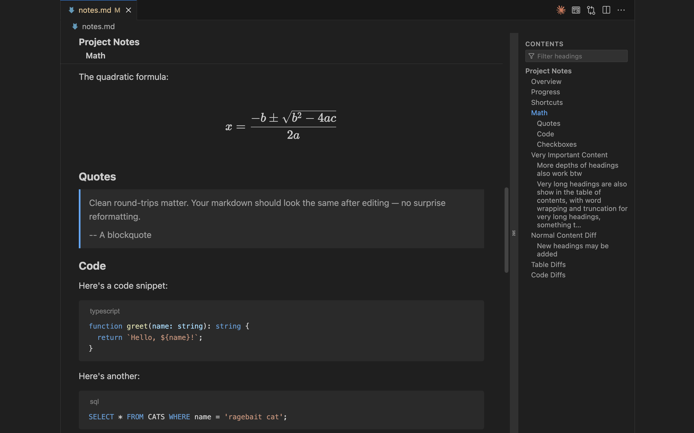

# Markdown Studio

I read as much `.md` as all other programming languages combined.

My own notes, AI agents generated reports, random READMEs.

I find it easier to read Notion-like markdown rather than raw markdown.

That's why Markdown Studio exists.

## The Cool Stuff

### Rich git Diffs

Rich editing, yes, of course. WYSIWYG for faster reading.

But no one has made rich diffs.

Till now.

### Seamless Sync.

Open in the Default Editor.

Open in the Rich Editor.

Open in the Browser.

It just works.

### Navigate without hassle.

Sticky headings so you can navigate long documents with ease.

Table of contents so you know where you are.

Clicky here, go there.

## Loaded With Features

### Modes

#### Default Editor

Default editor supports opening in Rich Editor and Browser modes.

Enjoy it because this will be the last time you open the vanilla view.

#### Rich Editor

Rich editor allows to go back to default editor mode directly. Also allows opening in the browser. All information is automatically and instantly synced.

#### Browser

Browser mode lets you open the rich editor as a Chrome/Firefox tab, so you can take it with you everywhere your browser goes.

Drag and drop images, gifs, etc.

It's like Notion, but you own the data.

### Rich editing

#### Slash Commands

The beloved `/` works out of the box. It's like you never left your favourite editor.

#### Checkboxes, Tables, Math, Quotes, Code Blocks, and your standard stuff.

Tables have options to:

- add row above, add row below
- add column to the left, add columns to the right
- remove rows, remove columns
- drop the entire table

You can write math using $\KaTeX$ in both inline and block modes.

## Known Limitations

- Conversion from markdown to rich text and back to markdown is not one-to-one exact map. The markdown after is normalized. You can control this via the settings icon in the rich editor mode.

---

## Meta Thingies

### Installation

Hit the Install button on this page. No login, setup or permissions required. It works out of the box.

### Keyboard shortcuts

| Shortcut    | Action                      |
| ----------- | --------------------------- |
| Cmd+Shift+M | Toggle rich / source editor |
| Cmd+F       | Find in document            |

### Privacy

I do not collect telemetry, analytics, or usage data.

I am too lazy to implement that.

Everything runs locally in your VS Code instance.

### Bugs/Feature Requests

If you encounter any bugs or have any feature requests, please [open an issue](https://github.com/chaudhary1337/markdown-studio-issues/issues).

I am actively using it myself, so expect frequent updates.

### Disclaimer

This software is provided as-is, without warranty of any kind. Use at your own risk.

---

PS: It is called "Mardown Studio" but In various places you'll see "Better Markdown", which was what I intended to call it originally.
